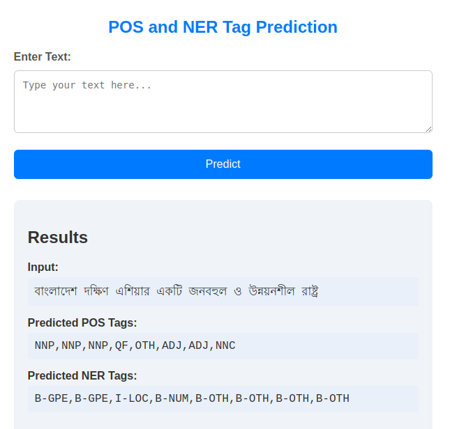

# Named Entity Recognition (NER) and Parts of Speech (POS) tagging

This repository contains a project focused on performing Parts of Speech (POS) tagging and Named Entity Recognition (NER) on Bangla language text. The project utilizes a BLSTM-CNN model architecture to analyze input sequences in Bangla and accurately predict the corresponding POS tags and named entities for each token


## Table of Contents

- [POS and NER Tagging]()
  - [Table of Contents](#table-of-contents)
  - [model](#model)
  - [Datasets](#datasets)
  - [Setup](#setup)
  - [Training & Evaluation](#training--evaluation)
  - [Usage](#usage)
    - [CLI](#cli)
    - [Model Inference API](#model-inference-api)
    - [Web Inference](#web-inference)
  - [License](#license)

## Model

This project uses a BLSTM-CNN architecture for POS tagging and Named Entity Recognition (NER). The BLSTM (Bidirectional Long Short-Term Memory) network captures contextual information from both directions in the sequence, while the CNN (Convolutional Neural Network) extracts local features.


- [**BLSTM-CNN(Pretrained)**](https://drive.google.com/drive/folders/1V1gf8w07wBSiUD91idk5T-YWG9D_66pE?usp=sharing)

## Datasets

We use a synthetically generated dataset for training the model..
- [**Dataset**](https://drive.google.com/drive/folders/1P52HoDkO1NX4fEJV5ao8M4EbBDFD4CeH?usp=sharing)

 
## Setup

For installing the necessary requirements, use the following bash snippet
```bash
$ git clone https://github.com/ali0806/Bangla-Language-POS-and-NER-Tagging.git
$ cd Bangla-Language-POS-and-NER-Tagging/
$ python -m venv env
$ source env/bin/activate # For Linux
$ pip install -r requirements.txt
```
* Use the newly created environment for running the scripts in this repository.

## Training & Evaluation

To see list of all available options, do  ```python train.py -h```

For Training model on single GPU, a minimal example is as follows:

```bash
$ python train.py \
    --num_epochs 50 \
    --batch_size 32 \
    --dropout_rate 0.5 \
    --learning_rate 0.001 \
    --weight_decay 1e-5 \
    --onnx_model_save True

```
**Note:** For navigate ```train.py``` first  go to ```src ``` folder with ```cd src``` command
* After training with default parameters

|     Tag          |   Accuracy   |     Precision     |      Recall     | F1-Score     |
|----------------|-----------|-----------|-----------|-----------|
| POS| 0.879|0.848|0.801|0.82|
| NER| 0.903|0.698|0.59|0.635|


## Usage
### CLI

```bash
python predict.py --input "বাংলাদেশ দক্ষিণ এশিয়ার একটি জনবহুল ও উন্নয়নশীল রাষ্ট্র"

```
```bash 
Output: 
input:বাংলাদেশ দক্ষিণ এশিয়ার একটি জনবহুল ও উন্নয়নশীল রাষ্ট্র
POS_Tags: NNP,NNP,NNP,QF,OTH,ADJ,ADJ,NNC
NER_Tags:B-GPE,B-GPE,I-LOC,B-NUM,B-OTH,B-OTH,B-OTH,B-OTH

```
**To use the model inference API for predictions and the web interface, you first need to start the Docker Compose service using the ```docker-compose.yml``` file.**

```bash
sudo docker-compose up --build
```
### Model inference API

```bash
curl -X POST "http://127.0.0.1:8000/predict" \
 -H "Content-Type: application/json" \
 -d '{"text": "আজকের হিসাব অনুসারে বাংলা উইকিপিডিয়ায় নিবন্ধ আছে ১,৫"}'

```

### Web Inference
```bash
http://127.0.0.1:5000
```
- View the web inference and output as follows:




 
## License
Distributed under the MIT License. See LICENSE for more information. 


